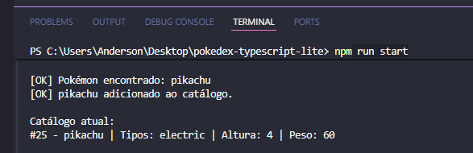
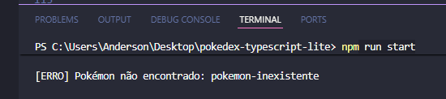
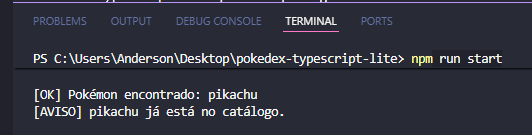
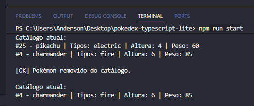

# Pokédex TypeScript Lite

## Sobre o projeto
O Pokédex TypeScript Lite é uma aplicação estruturada em Node.js com TypeScript executada via terminal. O sistema consulta dados diretamente da API pública PokeAPI, mapeia as respostas brutas e gerencia esses registros em um catálogo em memória altamente seguro e tipado.

## Objetivo
Praticar e aplicar os conceitos fundamentais de desenvolvimento back-end do Módulo 01:
- Ambiente Node.js e execução de scripts de desenvolvimento.
- Lógica assíncrona com Promises e sintaxe async/await.
- Tipagem estrita de dados, objetos e retornos com TypeScript.
- Programação Orientada a Objetos (POO) com encapsulamento de atributos.
- Manipulação avançada de dados com métodos funcionais de array.

## Tecnologias utilizadas
- **Node.js** (Ambiente de execução)
- **TypeScript** (Linguagem com tipagem estrita)
- **TSX** (Executor rápido de arquivos TypeScript)
- **PokeAPI** (Fonte de dados externa)
- **Git & GitHub** (Versionamento de código)

## Pré-requisitos
Antes de executar o projeto, garanta que você tem instalado em sua máquina:
- Node.js
- npm (gerenciador de pacotes)
- Git

## Como instalar

1. Clone este repositório para a sua máquina local:

`git clone https://github.com/AndersonPCustodio/pokedex-typescript-lite.git`


2. Acesse a pasta do projeto:

`cd pokedex-typescript-lite`


3. Instale as dependências de desenvolvimento necessárias:

`npm install`


## Como executar
Para compilar o projeto gerando a pasta `dist`:

`npm run build`


Para executar o projeto compilado em JavaScript:

`npm run start`


## Estrutura do projeto
A arquitetura foi organizada separando as responsabilidades de forma isolada em pastas (camadas):

```text
pokedex-typescript-lite/
│
├── src/
│   ├── main.ts               # Ponto de entrada (executa os fluxos de teste exigidos)
│   ├── models/
│   │   └── types.ts          # Interfaces de tipagem da API e do modelo do sistema
│   └── services/
│       ├── PokeApiService.ts # Serviço de integração assíncrona com a PokeAPI externa
│       └── BoxService.ts     # Classe de gerenciamento das regras de negócio do catálogo
│
├── package.json              # Configurações de dependências e scripts do Node
├── tsconfig.json             # Regras rígidas do compilador TypeScript (Strict Mode)
└── README.md                 # Documentação técnica do sistema
```

## Funcionalidades
- **Busca assíncrona** por nome ou ID de Pokémon utilizando fetch nativo.
- **Tratamento de exceções** estruturado com try/catch para evitar quebras no sistema.
- **Mapeamento de dados** (Data Mapping) para filtrar propriedades importantes (id, nome, tipos, altura, peso).
- **Armazenamento controlado** em memória por meio de Programação Orientada a Objetos.
- **Validação anti-duplicidade** baseada no identificador único (ID) do Pokémon.
- **Listagem e remoção formatada** de registros do catálogo local.

## Exemplos de execução

### Busca válida
- **Entrada testada**: `"pikachu"`
- **Saída obtida**:  
[OK] Pokémon encontrado: pikachu  
[OK] pikachu adicionado ao catálogo.



### Busca inválida
- **Entrada testada**: `"pokemon-inexistente"`
- **Saída obtida**:  
[ERRO] Pokémon não encontrado: pokemon-inexistente



### Duplicidade
- **Entrada testada**: Adicionar `"pikachu"` duas vezes consecutivas.
- **Saída obtida**:  
[AVISO] pikachu já está no catálogo.



### Remoção
- **Entrada testada**: Remover o ID `25`
- **Saída obtida**:  
[OK] Pokémon removido do catálogo.




## Conceitos aplicados

### TypeScript
O TypeScript foi aplicado para garantir consistência de dados em toda a aplicação. Foram definidos tipos estritos para parâmetros de funções (ex: `nomeOuId: string`, `id: number`) e tipos específicos de retorno para operações assíncronas (`Promise<PokemonResumo | null>`) e síncronas (`void`). O modo estrito (`strict: true`) garante que problemas com dados indefinidos sejam capturados antes da execução.

### Interface PokemonResumo
Localizada em `src/models/types.ts`, descreve o contrato de dados que o nosso sistema aceita internamente. Ela reduz o modelo inflado da PokeAPI para apenas 5 propriedades essenciais: `id` (number), `nome` (string), `tipos` (array de strings), `altura` (number) e `peso` (number).

### Fetch e async/await
A aplicação utiliza a função nativa `fetch` para realizar requisições HTTP assíncronas para a PokeAPI de forma limpa. A sintaxe `async/await` foi adotada no arquivo `src/services/PokeApiService.ts` para lidar com a natureza assíncrona da rede, permitindo ler as Promises de forma linear e legível.

### Tratamento de erros
O fluxo de integração externa foi encapsulado em um bloco `try/catch`. Caso a API retorne um status de erro (como `404 Not Found` para nomes incorretos), a propriedade `resposta.ok` identifica a falha, exibe uma mensagem amigável no terminal e retorna `null`, impedindo erros em cascata ou a interrupção abrupta do servidor Node.js.

### Métodos de array
Foram empregados 4 métodos funcionais modernos de manipulação de coleções:
1. `map`: Usado para transformar o array de objetos complexos da PokeAPI em uma lista simples contendo apenas os nomes dos tipos do Pokémon.
2. `some`: Utilizado na validação de duplicidade para checar se o ID do novo Pokémon já existe na coleção.
3. `forEach`: Aplicado no método de listagem para percorrer a coleção e imprimir de forma formatada cada registro no terminal.
4. `filter`: Utilizado no método de remoção para gerar um novo array contendo todos os Pokémon, exceto aquele cujo ID foi solicitado para exclusão.

### Classe CatalogoPokemon (implementada como BoxService)
Implementada em `src/services/BoxService.ts`, adota os princípios da Orientação a Objetos. Ela possui um atributo privado encapsulado (`private pokemons`) que protege a integridade da lista. O acesso e modificação desse atributo ocorrem estritamente através dos métodos públicos expostos: `adicionar()`, `listar()` e `remover()`.

## Organização do Kanban
- **Link do Kanban**:   
[Acesse o Quadro de Tarefas do Projeto](https://trello.com/invite/b/6a25c49e84db4f68e461da0c/ATTI1200bc8de1ced4c684ce075a2149d50b27823CFF/projeto-pokedex)

## Branches utilizadas
O desenvolvimento seguiu as boas práticas do GitFlow de maneira adaptada para o escopo:
- `main`: Código estável pronto para entrega.
- `develop`: Ramificação de integração de novas funcionalidades.
- `feature/pokedex`: Desenvolvimento dos recursos de busca, mapeamento e catálogo.
- `docs/readme`: Criação e preenchimento da documentação técnica.

## Melhorias futuras
- Criar menu interativo dinâmico no terminal para o usuário digitar os comandos.
- Implementar persistência física de dados salvando o catálogo em um arquivo local `pc_box.json` utilizando o módulo `node:fs/promises`.
